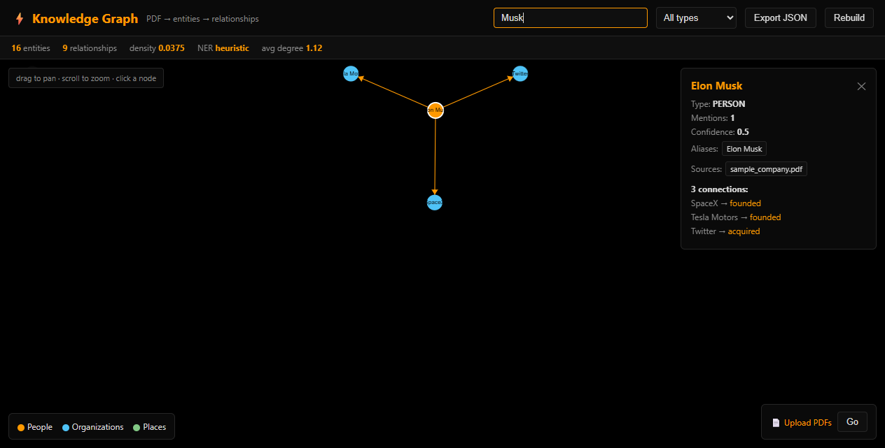

# ⚡ Knowledge Graph Visualization

> PDF → entities → relationships → an interactive graph you can actually explore.

A from-scratch rebuild of [encryptedtouhid/KnowledgeGraphVisualization](https://github.com/encryptedtouhid/KnowledgeGraphVisualization) (1★, Python) that ships what the original never had: **alias resolution, typed relations, source citations, confidence scores, PDF upload, and a live interactive explorer.**



## What the original was missing

| Original (1★) | This rebuild |
|---|---|
| "Elon Musk" and "Musk" = 2 separate nodes | Alias resolution: surname, acronym, case-folded → 1 node |
| Edges = raw verb text ("said", "was") | Typed relations: `founded`, `acquired`, `works_at`, `based_in`… |
| No confidence, no citations | Every edge has confidence + source PDF + page + sentence |
| PDFs must be dropped in a folder, CLI rebuild | Drag-drop upload in the browser → auto-rebuild |
| Static D3 page | Canvas force-directed graph — pan/zoom/drag/click/search/filter |
| spaCy required (download) | Zero-download heuristic NER (spaCy optional) |

## Quick start

```bash
pip install -r requirements.txt
python -m uvicorn kgraph.server:app --port 8000
# open http://127.0.0.1:8000
```

Drop PDFs into `docs/` (or use the upload button in the browser), and the graph builds itself.

## CLI

```bash
python -m kgraph.cli build --docs docs/ --out graph.json   # build + save
python -m kgraph.cli stats                                  # graph stats
python -m kgraph.cli search "Musk"                          # search + neighbors
python -m kgraph.cli export --format png                    # export PNG/GraphML/JSON
```

## How it works

```
PDF → per-page text → entities (NER) → alias resolution → typed relations
    → networkx DiGraph → JSON/GraphML/PNG → interactive explorer
```

- **Entity extraction** — spaCy `en_core_web_sm` if installed, otherwise a zero-download heuristic (title-case names, org keywords, acronyms, camelCase orgs like SpaceX, GPE patterns like "Hawthorne, California").
- **Alias resolution** — "Musk" → "Elon Musk", "NASA" → "National Aeronautics and Space Administration", case-insensitive.
- **Typed relations** — verb → relation-type mapping (`founded`, `acquired`, `works_at`, `based_in`, …), compound-verb subject sharing ("founded X and acquired Y"), role patterns ("X is the CEO of Y"), co-founder patterns.
- **Citations** — every edge carries the source PDF, page number, and sentence.
- **Confidence** — strong verbs + entity-type fit score each relation.

## API

| Endpoint | What it does |
|---|---|
| `GET /api/graph` | Full graph (nodes + edges + stats) |
| `GET /api/stats` | Graph statistics |
| `GET /api/search?q=Musk` | Search nodes + neighbors |
| `GET /api/documents` | List processed PDFs |
| `POST /api/upload` | Upload PDFs → rebuild |
| `POST /api/rebuild` | Rebuild from `docs/` |
| `GET /api/export?format=json\|graphml\|png` | Export |

## Tests

```bash
python -m pytest tests/ -q    # 24 tests — extraction, resolution, relations, API
```

## License

MIT.
